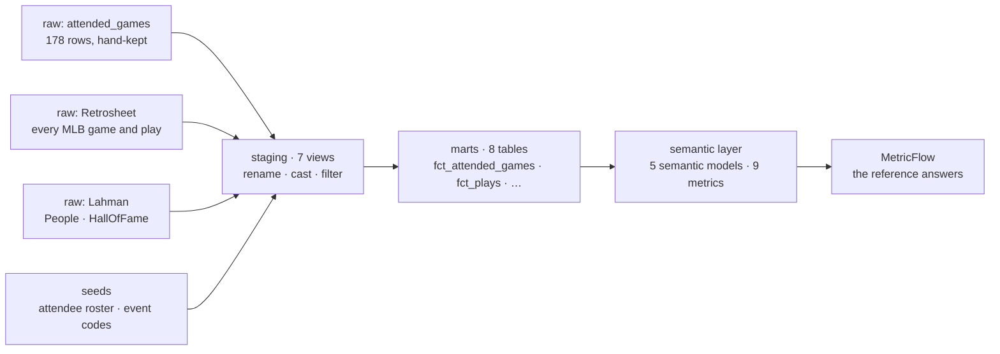

# wax-baseball-dbt — the contract

The 178 Major League games I've attended since 1984, modeled in **dbt Core on BigQuery**, and the semantic layer where seven questions about them get **one definition each**. Every other engine in [Keeping Score](https://nobodybeatstheviz.com/bits/wax-baseball/) is measured against the answers this project produces.

- **The story:** [The contract](https://nobodybeatstheviz.com/bits/the-contract/), batting 2nd
- **The live docs and lineage graph:** [nobodybeatstheviz.com/wax-baseball-dbt](https://nobodybeatstheviz.com/wax-baseball-dbt/), republished on every push to `main`

---

## The definition

This is what a home run is, for every tool in the build:

```yaml
- name: home_runs_count
  description: "Home runs Wax was in the building for. EVENT_CD 23, governed at last."
  agg: sum
  expr: case when event_code = 23 then 1 else 0 end
```

If you've built in Tableau, you know the calculated field `IF [Event Code] = 23 THEN 1 END`. It gets copied into the next workbook and drifts a little each time, until two dashboards disagree. Here it's written once, in `models/semantic/`, somewhere every tool has to read it.

## The seven questions

Nine metrics in `models/semantic/metrics.yml`. Seven are the questions; two are the win rate's numerator and denominator. The reference answers were recorded through MetricFlow on 2026-08-31:

| Question | Metric | Reference answer |
|---|---|---|
| How many games have I been to? | `games_attended` | 178 |
| How many ballparks? | `unique_stadiums` | 22 |
| How many home runs did I see? | `home_runs_witnessed` | 400 |
| How many runs? | `runs_witnessed` | 1,706 |
| What's my team's record when I'm there? | `attended_win_rate` (from `team_wins_attended` / `team_games_decided`) | Yankees 90–53 in 143 decided games (.629) |
| Who have I gone with most? | `games_per_attendee` | Melissa 57 · Bergan 27 · Al 26 · solo 16 · Poppa 14 |
| How many Hall of Famers have I seen play? | `hall_of_famers_seen` | 44 |

The same seven answers match across six engines: BigQuery, Snowflake, Databricks, Data 360 twice, and Tableau Next. That's 42 of 42, each engine answering through its own semantic layer. The harness that checks this lives in [`wax_baseball_parity`](https://github.com/nobodybeatstheviz/wax_baseball_parity).

## What's in here



- **16 models:** 7 staging views, 8 marts, and the time spine MetricFlow requires. Staging does only renames, casts, and filters. The joins and the meaning live in the marts, so if Retrosheet renames a column, one staging model changes and nothing downstream notices.
- **`fct_attended_games`:** one row per game I attended, 178 rows. Derived columns like `is_yankees_game` and `home_team_won` are computed once at build time. The demo row is `NYA199907250`: Clemens vs. Colon, Yankee Stadium, July 25, 1999, 89°F. The temperature column agrees with the memory.
- **Filter early.** The staging filter keeps only my 178 games (`vars.filter_to_attended`, on by default). That cuts each run to about 34 MB of scan instead of all of baseball history.
- **The attendee roster** (`seeds/attendee_roster.csv`) is the canonical name registry: 84 names, normalized down from 101. `sync_attendees_to_dbt.py` derives the attendance seed from a flat hand-kept file and refuses any name that isn't on the roster, so a typo can't quietly become a person.
- **`data-models/`** holds a Sigma Data Model spec over the fact table, pulled as YAML with the Sigma VS Code extension. It's the first semantic layer built on top of this project, from May.

## The test that failed on purpose

There are **119 tests**. The best story in the project is the one that failed.

A uniqueness test on Retrosheet's game id failed with **1,872 duplicates**. The public dataset includes Negro Leagues, exhibitions, and pre-MLB games for completeness, and some of them share ids with the modern schedule. My staging filter already kept only my 178, so nothing downstream was ever wrong.

So the question was one of test granularity. I dropped the test on the source I don't control, documented the finding in that source's description (`models/staging/sources.yml`), and kept the test where it applies, on the tables I do control. One test runs at `severity: warn` by design: `unique` on `stg_lahman_people.retro_id`. Lahman gives the same Retrosheet id to 21 pairs of pre-modern players. None of them are Hall of Famers, and none could appear in a game I attended, so the Hall of Fame join can't fan out. The warning is there so that a future Lahman release that changes this gets noticed without breaking the build.

## The agents

Two small Claude agents in `agents/`, one per side of the data:

- **`agent_queries_metric.py`**, the read side. It answers questions by asking for metrics by name through MetricFlow. It has no SQL tool at all, so it can't reinvent a join or rediscover `EVENT_CD = 23`. Run it with `--no-semantic-layer` and it gets a raw SQL tool instead: same question, and the trace shows the difference. Emails are staged, never sent.
- **`agent_writes_row.py`**, the write side. It records a new game only after four gates pass: every attendee resolves against the roster, the date isn't in the future, the game exists, and the row isn't a duplicate. Then it writes. A failed gate returns a structured error instead of a guess.

## Run it

Prerequisites: a GCP project with BigQuery, and `gcloud` authenticated **twice**, with `gcloud init` *and* `gcloud auth application-default login`. Missing the second one is the classic first-run failure.

```powershell
pip install dbt-core==1.11.10 dbt-bigquery==1.11.1
dbt deps
dbt seed
dbt build          # models + tests
dbt docs generate
```

`profiles.yml` needs a `wax_baseball` profile: BigQuery, OAuth, output dataset `wax_baseball_dbt`, location US.

**Metrics:** `mf query --metrics home_runs_witnessed`. One catch: the newest dbt engine (Fusion) ships no local metric engine, because its metric command is a client for the paid hosted service. MetricFlow runs from a separate dbt Core 1.11 install alongside it.

**Loading the raw sources:** `attended_games` is a hand-kept table. Retrosheet comes from BigQuery's public baseball dataset. For Lahman, run `load_lahman_bq.py`; it places the two tables the semantic layer needs (`People`, `HallOfFame`). The CSVs aren't in this repo; download them from [SABR](https://sabr.org/lahman-database/).

## Credits

Baseball data from **Retrosheet**, an all-volunteer outfit that has been keeping score on the game's history since 1989. The information used here was obtained free of charge from and is copyrighted by Retrosheet. Interested parties may contact Retrosheet at "www.retrosheet.org".

Hall of Fame and player data from the **SABR Lahman Baseball Database** (2025 release), CC BY-SA 3.0.

Code: MIT (see `LICENSE`). Part of [Nobody Beats the Viz](https://nobodybeatstheviz.com).
